Visualizing data
================

> What is to be sought in designs for the display of information is the
> clear portrayal of complexity. Not the complication of the simple;
> rather the task of the designer is to give visual access to the subtle
> and the difficult — that is, the revelation of the complex.

-   Edward Tufte, The Visual Display of Quantitative Information

Randy's guiding principles of data visualization
------------------------------------------------

We can make up lots of rules, but there are more ways to make bad
graphics than we have time to discuss. With that in mind, there are
three principles that I believe will help you avoid most graphical faux
pas.

1.  What people see should be what the data are trying to say.
2.  Your picture really should be worth 1000 words, but it shouldn't
    require a lot of words.
3.  Anything that distracts from the visualization should be left out.

Different software
==================

This is not a complete list, but is representative of some of the better
options.

<table>
<thead>
<tr class="header">
<th align="center">Software</th>
<th align="center">Free</th>
<th align="center">Open Source</th>
<th align="center">GUI</th>
<th align="center">Scriptable</th>
<th align="center">Win</th>
<th align="center">Mac</th>
</tr>
</thead>
<tbody>
<tr class="odd">
<td align="center">GNU Plot</td>
<td align="center">x</td>
<td align="center">x</td>
<td align="center">x</td>
<td align="center">x</td>
<td align="center">x</td>
<td align="center">x</td>
</tr>
<tr class="even">
<td align="center">Graph Pad Prism</td>
<td align="center"></td>
<td align="center"></td>
<td align="center">x</td>
<td align="center"></td>
<td align="center">x</td>
<td align="center">x</td>
</tr>
<tr class="odd">
<td align="center">Matlab</td>
<td align="center"></td>
<td align="center"></td>
<td align="center"></td>
<td align="center">x</td>
<td align="center">x</td>
<td align="center">x</td>
</tr>
<tr class="even">
<td align="center">Plotly</td>
<td align="center">x</td>
<td align="center"></td>
<td align="center">x</td>
<td align="center"></td>
<td align="center">web</td>
<td align="center">based</td>
</tr>
<tr class="odd">
<td align="center">R</td>
<td align="center">x</td>
<td align="center">x</td>
<td align="center">~</td>
<td align="center">x</td>
<td align="center">x</td>
<td align="center">x</td>
</tr>
<tr class="even">
<td align="center">Sigma Plot</td>
<td align="center"></td>
<td align="center"></td>
<td align="center">x</td>
<td align="center"></td>
<td align="center">x</td>
<td align="center">x</td>
</tr>
<tr class="odd">
<td align="center">Veusz</td>
<td align="center">x</td>
<td align="center">x</td>
<td align="center">x</td>
<td align="center">x</td>
<td align="center">x</td>
<td align="center">x</td>
</tr>
</tbody>
</table>

What not to use: Excel
----------------------

Excel will plot data for you, but outside of getting a quick look at
your data, you shouldn't use it for data visualization...and there are
much better tools for getting a quick look at your data. Some issues I
have with Excel include:

-   It is extremely difficult to customize your graphics (e.e. color,
    size, labels, ... just about everything is difficult to customize),
    and the defaults aren't exactly impressive (usually violates \#1 and
    often \#3).
-   Excel places too much emphasis on fancy fluff that obscures data.
    For example (violation of \#1): 
-   The resolution of Excel graphics is poor (i.e. it looks pixelated
    when you look closely at it -- violation of \#3 and often \#1).
-   The intercept is included in every scatter plot by default (possible
    violation of \#1 and/or \#3)

What not to plot
----------------

We shouldn't make figures out of every possible collection of data!

-   Sometimes text is really better than a figure (violation of \#2):
    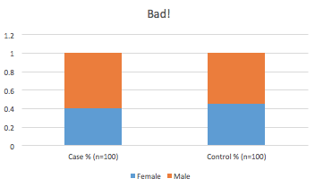
    -   Instead use: "40% of cases and 45% of controls were female (p =
        0.24)"
-   Sometimes a table is better than a figure (could be a violation of
    \#1, \#2, and \#3): 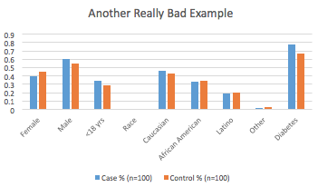
    -   Instead use:

<table>
<thead>
<tr class="header">
<th align="left"></th>
<th align="right">Case % (n=100)</th>
<th align="right">Cont % (n=100)</th>
<th align="right">p-value</th>
</tr>
</thead>
<tbody>
<tr class="odd">
<td align="left">Female</td>
<td align="right">40%</td>
<td align="right">45%</td>
<td align="right">0.24</td>
</tr>
<tr class="even">
<td align="left">&lt;18 Yrs</td>
<td align="right">34%</td>
<td align="right">55%</td>
<td align="right">0.22</td>
</tr>
<tr class="odd">
<td align="left">Race</td>
<td align="right"></td>
<td align="right"></td>
<td align="right"></td>
</tr>
<tr class="even">
<td align="left">- Caucasian</td>
<td align="right">46%</td>
<td align="right">43%</td>
<td align="right">0.33</td>
</tr>
<tr class="odd">
<td align="left">- African American</td>
<td align="right">33%</td>
<td align="right">34%</td>
<td align="right">0.44</td>
</tr>
<tr class="even">
<td align="left">- Latino</td>
<td align="right">19%</td>
<td align="right">20%</td>
<td align="right">0.43</td>
</tr>
<tr class="odd">
<td align="left">- Other</td>
<td align="right">2%</td>
<td align="right">3%</td>
<td align="right">0.33</td>
</tr>
<tr class="even">
<td align="left">Diabetes</td>
<td align="right">78%</td>
<td align="right">67%</td>
<td align="right">0.04</td>
</tr>
</tbody>
</table>

Scatter plots
=============

This is the data set we will use for this section:

    set.seed(289347)
    dat <- data_frame(x = rnorm(100, mean = 23, sd = 5),
                      y = x + rnorm(100, sd = 3))

Recreate the following scatter plots:

A simple scatter plot
---------------------

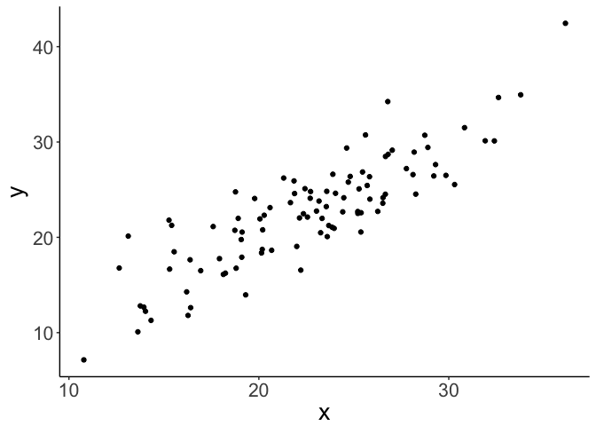

Adding a linear regression line is a nice touch
-----------------------------------------------

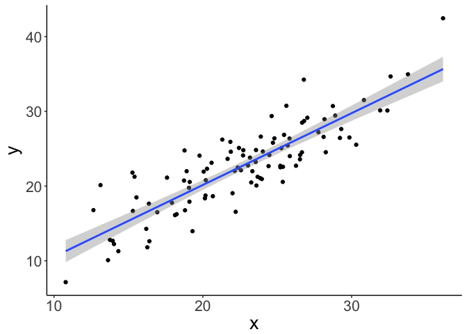

More modifications
------------------

Here we have added the grid lines back into the figure. I generally
prefer not to use them, but there are situations when we might like to
include them. When do you think we would want to include grid lines?

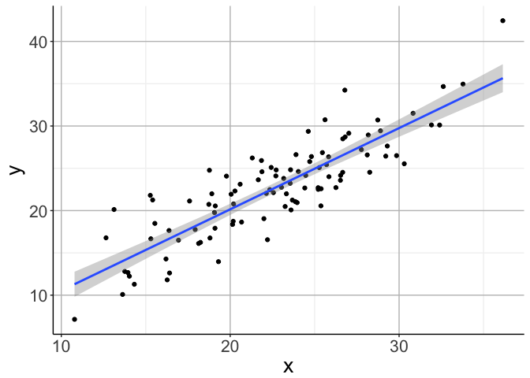

Rug Plot
--------

A rug plot is one way to include the marginal distribution along the x
and y axes. Try replicating this figure using the `geom_rug()` function.

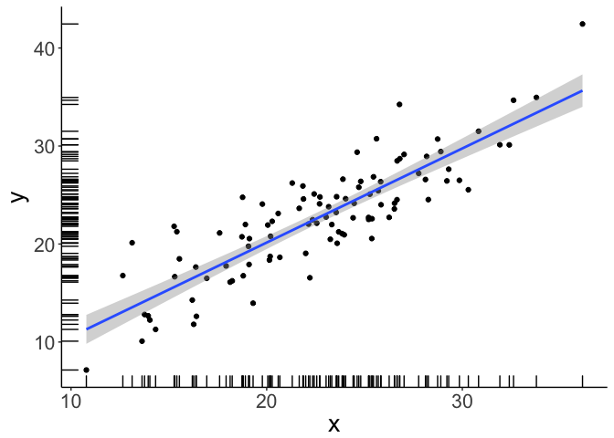

Box and Violin plots
====================

Try replicating the figures in this section on your own. We will use the
following data set for this section:

    n <- 500 # individuals per group

    set.seed(239847)
    bxplt <- data_frame(group = as.factor(rep(1:3, each = n)),
                        value = c(rnorm(n, 5, 2),
                                  rnorm(n/2, 8, 2), rnorm(n/2, 1, 2),
                                  rchisq(n, 2)))

Standard box plot
-----------------

We will use `geom_boxplot()` for this figure. Does this capture the data
well? How could we do better?

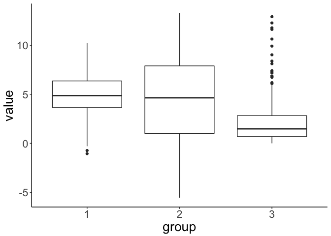

Raw scatter plot
----------------

Using `geom_jitter()` shows the distribution of the center group is
bimodal (I used `alpha = 0.2`). This information is masked entirely in
the previous figure.

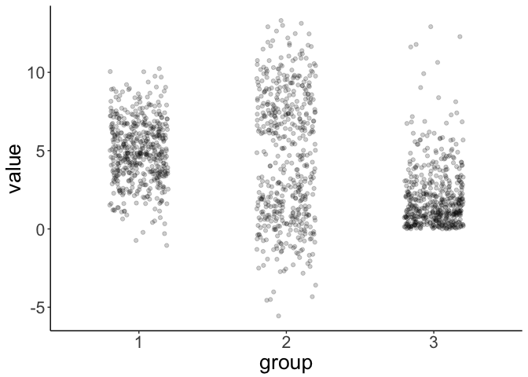

Violin plots
------------

A violin plot using `geom_violin()` is a much cleaner alternative to a
raw scatter plot.

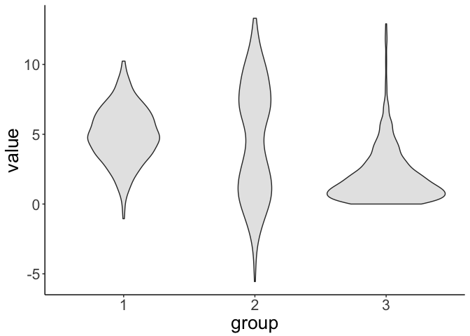

Box and Violin plot
-------------------

I actually prefer to see the information from both the box and violin
plots in one figure.

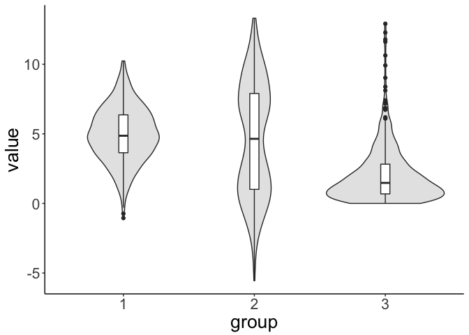

Transforming data
=================

Keep in mind that we occasionally need to transform data in order to
visualize relationships between variables. Use these two data sets to
replicate the figures in this section.

    n <- 500 # number of data points

    # generate continuous data set to work with
    set.seed(234789)
    trans_cont <- data_frame(x = rnorm(n),
                             y = 10^(x + rnorm(100)))

    # generate categorical data set to work with
    trans_cat <- data_frame(OR = c(0.4, 1.2, 1.7, 0.9),
                            lOR = log(OR),
                            se = rep(.2, 4),
                            lower = exp(lOR - 1.96*se),
                            upper = exp(lOR + 1.96*se),
                            group = c('A', 'A', 'B', 'B'),
                            treat = c('Treatment', 'Placebo', 'Treatment', 'Placebo'))

These data are not well visualized. Note that we are using the default
method to `geom_smooth()`, but we've removed the standard error.

    ## `geom_smooth()` using method = 'loess'

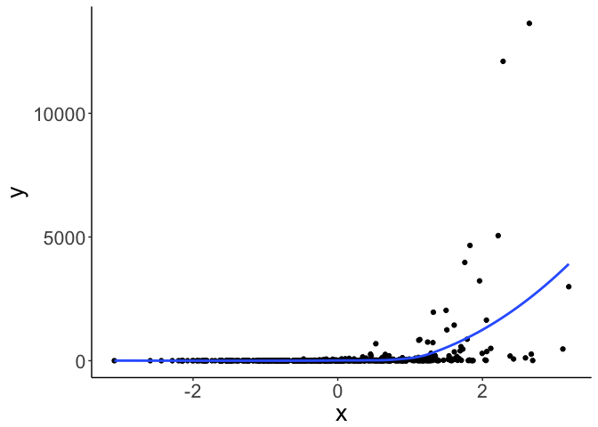

When rescaling the y-axis, this becomes much more clear. On this scale,
using `method='lm'` appears to be the appropriate choice.

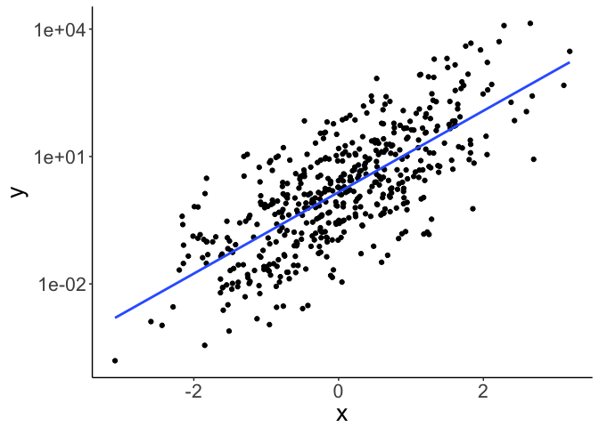

When working with categorical data, appropriately scaling can also be
important. We'll include the R code here, as this figure is
significantly more complicated. What does each line do? Note how ggplot2
layers elements onto the figure. This makes reading (and writing) the
code much more intuitive.

    # base figure
    pos <- position_dodge(width = 0.2)

    (g <- ggplot(trans_cat, aes(treat, OR, color = group)) +
          geom_point(position = pos, size = 2) +
          geom_errorbar(aes(ymin = lower, ymax = upper), position = pos, width = 0.2, size = 0.7) +
          geom_hline(yintercept = 1, linetype = 2) +
          theme(axis.title.x = element_blank(),
                axis.line.x = element_blank(),
                axis.ticks.x = element_blank()) +
          scale_color_manual(values = cbbPalette))

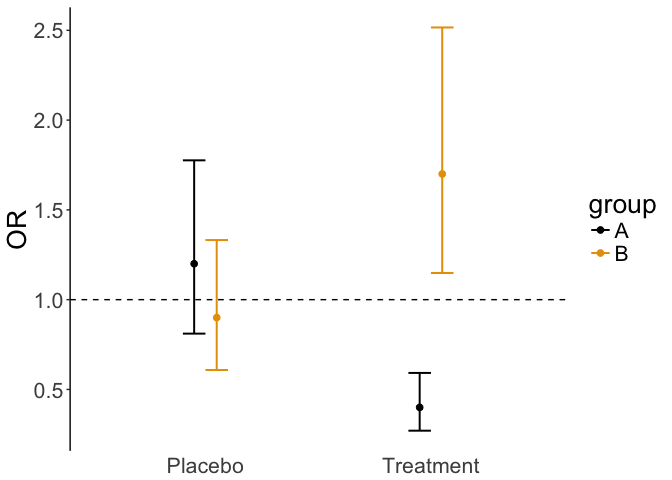

    # this puts ORs on both sides of 1 on an equal scale -- much easier to see what is going on
    # ggplot's default is to display the untransformed numbers on the y-axis.
    # That might be good for some people, but others will be confused and want to see the log OR
    # we include both here
    g + scale_y_continuous(trans = 'log', breaks = c(0.3, 0.5, 1, 2),
                           sec.axis = sec_axis(trans = ~ log(.), name = 'log OR')) +
        guides(color = FALSE)

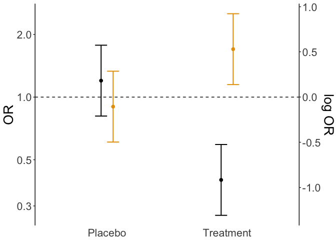

Colors
======

The choice of colors is extremely important when presenting
visualizations of data. When possible the best practice is to present
figures in black and white or grey scale. Colors can make certain
relationships pop, though. This data set was used to generate the
following figures

    set.seed(29384)
    dat <- data_frame(x = rnorm(300),
                      y = c(rnorm(200),
                            x[201:300] + rnorm(100, sd = .5)),
                      g = factor(rep(c(1,1,2), each = 100)))

When we look at this figure, all we see is a random scatter of points.

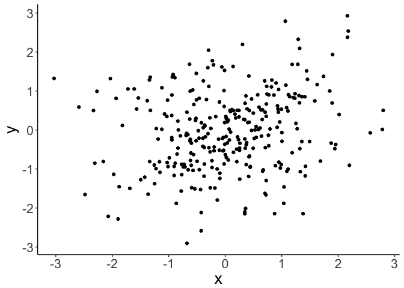

When we add color, conditional on `g`, however, a different story begins
to emerge (I'm using `green3` and `red` as arguments to
`scale_color_manual()`).

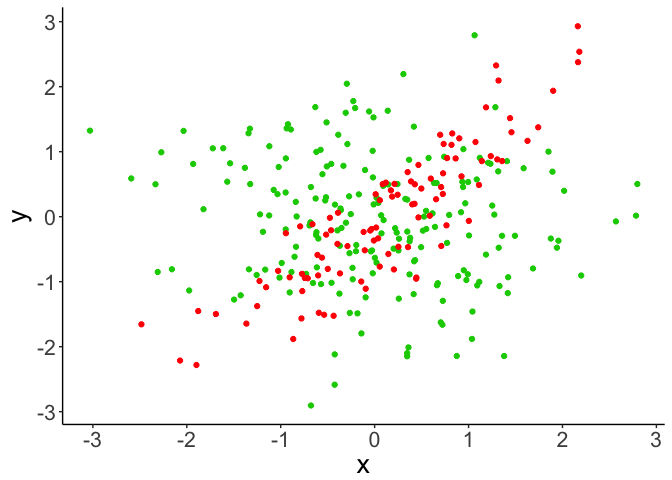

This is striking to most of us, but less so for those with certain
varieties of color blindness.

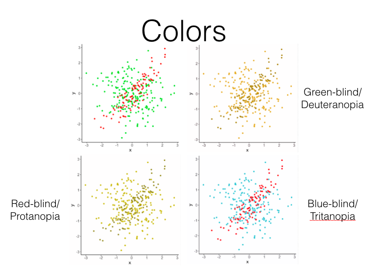

The default colors are really not that great either.

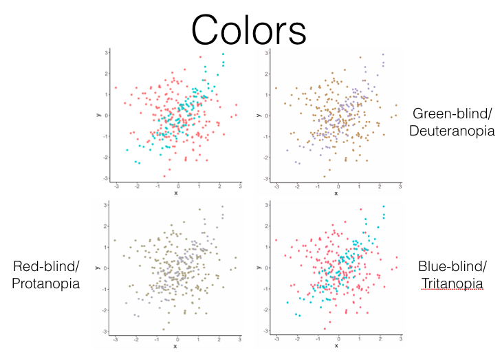

Using this colorblind palette, however, results in a much nicer figure
for everyone.

    # nice colorblind pallete found at http://www.cookbook-r.com/Graphs/Colors_(ggplot2)/
    # colorbrewer2.org also has some nice color palletes
    cbbPalette <- c("#000000", "#E69F00", "#56B4E9", "#009E73", "#F0E442", "#0072B2", "#D55E00", "#CC79A7")

    # cbbPalette with alpha = 0.5
    tmp <- col2rgb(cbbPalette) / 255
    cbbPalette_alpha <- rgb(tmp[1,], tmp[2,], tmp[3,], 0.5)

    better <- g + scale_color_manual(values = cbbPalette)

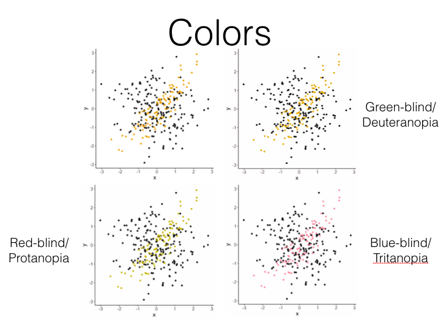

The palette her talk came from cookbook-r.com, but colorbrewer2.org has
a good palette selection as well as several other sources if you look
for them. It is always a good idea to check your figures using a color
blindness simulator like [ColorOracle](http://colororacle.org) or one of
the other online resources available online.
