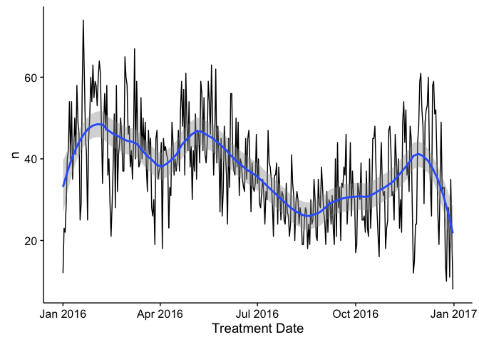

Introduction
============

We will start out class today with the Case Study at the end of Chapter
6 of Buffalo. Then we will follow up on some of the UNIX data tools from
Chapter 7 that we skipped a few weeks back.

Exercise 1
==========

This exercise follows directly from this week's module, so you should be
able to

-   Create a directory to work from for today.
-   Download these files from the command line
    -   `ftp://ftp.ensembl.org/pub/release-74/fasta/mus_musculus/dna/Mus_musculus.GRCm38.74.dna.toplevel.fa.gz`
    -   `ftp://ftp.ensembl.org/pub/release-74/gtf/mus_musculus/Mus_musculus.GRCm38.74.gtf.gz`
-   Take a look at the FASTA headers in this file (remember to use the
    tab button to avoid having to type the entire file name).
    -   You'll want to use `zgrep` to filter everything out except the
        headers, which start with "&gt;".
    -   Printing this all to the screen might not be what you want, so
        pipe the output to `less`
-   The SHA1 sum is `01c868e22a9815c0c8ac247c2154c20ae7899c5f`. Did the
    file download properly?

Exercise 2
==========

In this exercise we will be using the `join` command, which is used to
merge two files.

-   Start by fetching these two data files:
    -   <https://raw.githubusercontent.com/BIFXapps/bds-files/master/chapter-07-unix-data-tools/example.bed>
    -   <https://raw.githubusercontent.com/BIFXapps/bds-files/master/chapter-07-unix-data-tools/example_lengths.txt>
-   Inspect the files from the command line. How are they formatted, how
    many lines are there, etc...?
-   We need to sort these files before we join them. Look at `man sort`
    to figure out how to do this.
-   Sort *example.bed* and *example\_lengths.txt*
-   Join the two files using the following syntax:

        join
            -1 <column number of example_sorted.bed to match on>
            -2 <column number(s) of example_lengths.txt to match on>
            <path to file 1>
            <path to file 2>

-   Check the file to be sure it worked the way you expected using the
    following commands:
    -   `head`
    -   `wc`

There are several different types of joins:

-   left join - returns all records from the left table/file
-   right join - returns all records from the right table/file
-   inner join - returns records only if matches exist in both
    tables/files
-   outer join - all records from both tables/files are returned

explained in detail by [C.L.
Moffatt](https://www.codeproject.com/script/Membership/View.aspx?mid=5909363)](https://www.codeproject.com/KB/database/Visual_SQL_Joins/Visual_SQL_JOINS_orig.jpg)

By default the `join` command performs an inner join by default, but you
can using the `-a` option to include all rows from one or both of the
files. In our case, an inner join is sufficient. If we were missing some
values from *example\_lengths.txt*, however, we might want to do use the
`-a` option.

    # left join
        join
            -a 1
            -1 <column number of example_sorted.bed to match on>
            -2 <column number(s) of example_lengths.txt to match on>
            <path to file 1>
            <path to file 2>
            
    # right join
        join
            -a 2
            -1 <column number of example_sorted.bed to match on>
            -2 <column number(s) of example_lengths.txt to match on>
            <path to file 1>
            <path to file 2>

    # outer join
        join
            -a 1
            -a 2
            -1 <column number of example_sorted.bed to match on>
            -2 <column number(s) of example_lengths.txt to match on>
            <path to file 1>
            <path to file 2>

-   Truncate *example\_lengths.txt* using this command:
    `grep -v chr3 example_lengths.txt > example_lengths_trunc.txt`
-   Perform the join above using the same command as before.
-   Perform the join again using the `-a 2` option (right join).

Exercise 3
==========

We will explore the `sed` command in this exercise. As you've read in
the book, stream editing via the `sed` command allows us to make small
edits to the data piping through a series of commands without having to
load the entire file into memory. These small edits can be especially
helpful when the output of one command doesn't exactly match the input
of the next command.

Regular Expressions
-------------------

Before we start with `sed`, however, lets go over some basic rules and
syntax for regular expressions. We've seen a little of this in our
*.gitignore* files, as well as in the book. There are three types of
regular expression parts:

-   Anchors, used to specify a position on the line of text
-   Character Sets, used to match characters
-   Modifiers, used to specify how many times the previous character
    should be repeated

<table>
<thead>
<tr class="header">
<th>Type</th>
<th>Regex</th>
<th>Meaning</th>
</tr>
</thead>
<tbody>
<tr class="odd">
<td>Anchors</td>
<td><code>^</code></td>
<td>Beginning of the line</td>
</tr>
<tr class="even">
<td></td>
<td><code>$</code></td>
<td>End of the line</td>
</tr>
<tr class="odd">
<td>Character Sets</td>
<td><code>[a-z]</code></td>
<td>A lower case character</td>
</tr>
<tr class="even">
<td></td>
<td><code>[A-Z]</code></td>
<td>An upper case character</td>
</tr>
<tr class="odd">
<td></td>
<td><code>[0-9]</code></td>
<td>An number character</td>
</tr>
<tr class="even">
<td></td>
<td><code>.</code></td>
<td>Any single character</td>
</tr>
<tr class="odd">
<td></td>
<td><code>[abc]</code></td>
<td>Any letter in {a, b, c}</td>
</tr>
<tr class="even">
<td></td>
<td><code>[^a]</code></td>
<td>Any character that is <em>not</em> an 'a'</td>
</tr>
<tr class="odd">
<td></td>
<td><code>\e</code></td>
<td>Escape</td>
</tr>
<tr class="even">
<td></td>
<td><code>\f</code></td>
<td>Form feed</td>
</tr>
<tr class="odd">
<td></td>
<td><code>\n</code></td>
<td>New line</td>
</tr>
<tr class="even">
<td></td>
<td><code>\r</code></td>
<td>Carriage return</td>
</tr>
<tr class="odd">
<td></td>
<td><code>\t</code></td>
<td>Tab</td>
</tr>
<tr class="even">
<td>Modifiers</td>
<td><code>?</code></td>
<td>0 or 1 repetitions</td>
</tr>
<tr class="odd">
<td></td>
<td><code>*</code></td>
<td>0 or more repetitions</td>
</tr>
<tr class="even">
<td></td>
<td><code>+</code></td>
<td>1 or more repetitions</td>
</tr>
<tr class="odd">
<td></td>
<td><code>\{n\}</code></td>
<td>exactly <em>n</em> repetitions</td>
</tr>
<tr class="even">
<td></td>
<td><code>\{n,m\}</code></td>
<td>at least <em>n</em> and not more than <em>m</em> repetitions</td>
</tr>
</tbody>
</table>

As you can see, some characters have special meaning in regular
expressions. If you want to search for a '\[' or a '.', you will need to
escape the special meaning with a `\` (e.g. `\[` or `\.`).

There is one other handy construct, `\(...\)`, used in the examples in
the book. This contains a specific pattern that you want to remember. If
you recall Buffalo uses `sed` to split out the string,
`chr1:28427874-28425431`, into the string, `chr1\t28427874\t28425431`.
The following regular expression captures the first part of that string,
which we can recall later with `\1`.

    \(chr[1-9]+\)

Practicing with sed
-------------------

The main way we will use `sed` is to find and replace text. Find a `sed`
command to convert between each string pair. Remember to use the `g`
option at the end of the command to include more than just the first
occurrence, and you can use the `i` option to make the search
case-insensitive.

-   "the other end" -&gt; "an other end"
    -   `echo "the other end" | sed s/the/an/`
-   "the other end, the other end" -&gt; "an other end, an other end"

-   "The other end, the other end" -&gt; "An other end, an other end"

-   `"chr1\t28427874\t28425431"` -&gt; "chr1:28427874-28425431"

-   Pull the ranges of all exons in *Mus\_musculus.GRCm38.74.gtf.gz*

Bonus Challenge Problem
=======================

Using the `curl` package in R, download the 2016 dataset from the [NEISS
site](https://www.cpsc.gov/Research--Statistics) and recreate the
following figures depicting the incidence of basketball-related injuries
over the year (by day in the first figure and by day of the week in the
second figure). If you would like a hint, these are all of the functions
I used (many of which we haven't discussed in class):

-   `base::file.exists()`
-   `base::grep()`
-   `base::if()`
-   `base::tempfile()`
-   `curl::curl_download()`
-   `dplyr::count()`
-   `dplyr::mutate()`
-   `ggplot2::geom_line()`
-   `ggplot2::geom_point()`
-   `ggplot2::geom_smooth()`
-   `ggplot2::ggplot()`
-   `ggplot2::xlab()`
-   `readxl::read_excel()`

