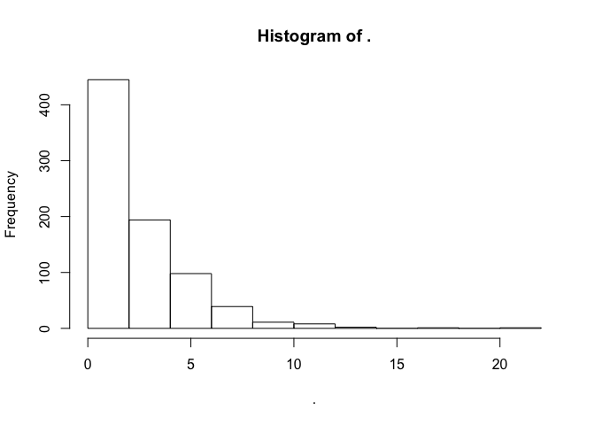

GenomicFeatures
===============

Today we will be exploring the `GenomicFeatures` package, primarily
following along with the [`GenomicFeatures`
vignette](http://www.bioconductor.org/packages/release/bioc/vignettes/GenomicFeatures/inst/doc/GenomicFeatures.pdf).

    library(GenomicFeatures)

    # this is the dataset we will be working with
    library(TxDb.Hsapiens.UCSC.hg19.knownGene)
    txdb <- TxDb.Hsapiens.UCSC.hg19.knownGene #shorthand (for convenience)

Restricting the analysis to a subset of chromosomes
---------------------------------------------------

The `seqlevels()` function will let you restrict your analysis to
specific chromosomes:

    # restrict analysis to chr1
    seqlevels(txdb) <- 'chr1'

    # reset seqlevels
    seqlevels(txdb) <- seqlevels0(txdb)

**Problem 1:** Restrict our analysis from here on out to only include
`'chr15'`.

    # check to see if you were successful
    seqlevels(txdb)

    ## [1] "chr15"

Retrieving information
----------------------

-   `columns()` returns the available columns from txdb
-   `keytypes()` returns the available keytypes from txdb that you can
    use to subset the data
-   `select()` returns a subset of the data
    -   `keys` specifies the rows you want returned (e.g. matching on a
        vector of gene IDs)
    -   `columns` specifies the columns you you want returned
    -   `keytype` specifies the identifier type in `keys`

\*\*Problem 2:\* Complete the R command below to return the transcript
name, strand and chromosome for all gene IDs in the *keys* variable:

    select(txdb, 
           key = c("100033416", "100033417", "100033420"),
           columns = , # (hint: check out columns(txdb)
           keytype = ) # (hint: check out keytypes(txdb)

GRanges objects
---------------

    # fetch all transcripts
    tx <- transcripts(txdb)

    # only fetch transcripts on the + strand (of chromosome 15, right?)
    tx <- transcripts(txdb, filter = list(tx_strand = '+'))

    # fetch the promoter regions from txdb
    pr <- promoters(txdb)

**Problem 3:** Modify the default promoter region to include up to 400
bp downstream, and fetch all of the exons from chromosome 15. You may
want to check `args(promoters)` and `?exons`.

How do the exons compare with the transcripts?

    # total numbers
    length(ex)

    ## [1] 10771

    length(tx)

    ## [1] 1732

    # widths
    width(ex) %>%
        summary()

    ##    Min. 1st Qu.  Median    Mean 3rd Qu.    Max. 
    ##     3.0    86.0   132.0   322.9   208.0 11530.0

    width(tx) %>%
        summary()

    ##    Min. 1st Qu.  Median    Mean 3rd Qu.    Max. 
    ##      20      93   11630   39890   46530  887000

    # ranges
    range(ex)

    ## GRanges object with 2 ranges and 0 metadata columns:
    ##       seqnames                ranges strand
    ##          <Rle>             <IRanges>  <Rle>
    ##   [1]    chr15 [20362688, 102516808]      +
    ##   [2]    chr15 [20319595, 102519296]      -
    ##   -------
    ##   seqinfo: 1 sequence from hg19 genome

    range(tx)

    ## GRanges object with 1 range and 0 metadata columns:
    ##       seqnames                ranges strand
    ##          <Rle>             <IRanges>  <Rle>
    ##   [1]    chr15 [20362688, 102516808]      +
    ##   -------
    ##   seqinfo: 1 sequence from hg19 genome

    # coverage
    coverage(ex) %>%
        runValue() %>%
        unlist() %>%
        summary()

    ##    Min. 1st Qu.  Median    Mean 3rd Qu.    Max. 
    ##  0.0000  0.0000  1.0000  0.6232  1.0000  5.0000

    coverage(tx) %>%
        runValue() %>%
        unlist() %>%
        summary()

    ##    Min. 1st Qu.  Median    Mean 3rd Qu.    Max. 
    ##   0.000   0.000   1.000   1.806   3.000  17.000

Grouping ranges
---------------

-   `transcriptsBy()` will return a `GRangesList` with grouped
    transcripts
    -   `by` specifies what to group by (gene, exon or coding sequence)
-   `exonsBy()` and `cdsBy()` do the same for exons and coding sequence
    (`by = 'tx'` is also an option for these functions)

Let's group all transcripts by gene using `transcriptsBy()`.

    txByGene <- transcriptsBy(txdb, by = 'gene')

    # How many genes are we looking at here?
    length(txByGene)

    ## [1] 799

    # How many transcripts do we have for each gene?
    sapply(txByGene, length) %>%
        hist()

**Problem 4:** Group all exons by transcript, and rename the resulting
list with the transcript names (instead of the transcript IDs).

Bonus Challenge Problem
=======================

Make a TxDbPackage for an organism using UCSC as a source for the data.
You may find the `GenomicFeatures` package and the note on pages 312-13
of the book helpful! Provide some sample queries to show that your
package works.
